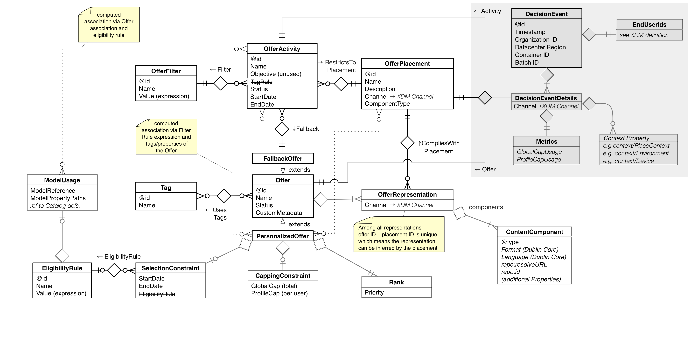

While Content is information that is directed towards an audience for consumption in a (digital) experience, Offer Management is used to personalize this experience by selecting the Next Best Offer and using the attached Content in a place within the experience that is marked as dynamic and filled by an offer.

In Offer Management the goal is to centralize the decisions that lead to those personalizied experiences across various channels. Interactions within one channel can then be analyzed to make decisions on what the next best offer, content or experience would be in a different channel.

Decisioning happens based not only on the offers' constraints and parameters but more importantly based on individual profiles. In addition the decision may be based on which activity the end user associated with a profile engages in. This allows content to be personalized but also adapted to more contextual data.

The main concepts in the domain of Offer Management are:

- *Offer*: This is a data object that references one or several Contents 
  - Offers are used as the driver of the decisions when personalizing the experience or as a fallback when no qualifying Offer can be found.
  - A single Offer can have multiple contents variants. An Offer Representation is the data that connects Offers to Content. Content is information that is directed towards an audience for consumption in a (digital) experience. Content is delivered through channels (or a particular medium). 
  - Offers used for personalization have various entities that serve as control data, each driving a different aspect of the overall decisioning process. 
  - _Eligibility_ Personalization Offers use a rules to determine if an offer must be excluded or can be included in the decisioning process based on context information such as the user's profile instance. The entity of the offer that controls this aspect is the SelectionConstraint.
  - _Frequency_ Personalization Offers use a calculations to determine if a proposition has been made too many times already. The entity of the offer that controls this aspect is the CappingConstraint. 
  - _Priority_ Personalization Offers use a calculations to determine if the proposition of one offer should be made in favor of another offer within a given activity and context. The entity of the offer that controls this aspect is the Rank. 

- *Offer Activity*: This is a data object that represents the execution of the decisioning processes with offers
  - Offer Activities reference an Offer Filter object that is used reduce the offer choices by topic. This represent the *relevancy* aspect of the decisioning
  - Offer Activities reference an Offer Placement object that is used reduce the offer choices by their ability to fit *technically* into the overall experience, they also define the actual place in the experience where the winning selection's content will be inserted
  - Offer Activities reference a single Fallback Offer that is used when all other contraints are applied and the resulting list of sutable offers is empty.

In the diagram below the entities and relationships are shown for the offer management models. Strong entities are instances with their own `@id`. Those instances can be created independently of other instances.
Strong entities have a solid single line border. 
Weak entities are dependent on a single strong entity, don't have an `@id` property and are shown with a thin double line. 
Relaships are shown between entities as connectors with a diamond shape. The direction of the relationship is also shown. A formal description of the relationships is given in the file relationship.descriptors.schema.json
The end of a relationship connector in the diagram has special arrow symbols. There are two symbols on each end of the connection. The one closer to the entity box denotes the cardinality, or max degree (more below) and the one right before, closer to the diamond denotes the optionality (min degree).
The symbols are interpeted as follows:
- if the pairs of entities were listed in a table (only binary relations used here) and one would filter the table rows by any one of the `@id` of in a column the other entity side/column would be represented in that table by a certain number of entities/rows.
- Cardinality: if that number is greater than one (`toMany`-relationship) then an inverted arrow is shown (a.k.a "crows-foot notation", otherwise a single short line crossing the connector is shown (`toOne`-relationship).
- Optionality: when filtering for a single `@id` in one column, must result in rows that have all non-null values for the other column then second single short line crossing the connector is shown before the cardinality symbol. If null values are allowed in the other column then a small circle crossing the connector is shown before the cardinality symbol.

The relationships between strong and weak entities or are shown by their relationship symbols directly attached to another entity

The upper right corner shows a number of entities that are still being named and defined. They are not part of the offer-management model yet, but listed here for future guidance.